<!--truncate-->

## 1. 工作区快捷键


### 显示/隐藏侧边栏

- Mac: `Cmd` + `B`
- Win: `Ctrl` + `B`


### 🔥 显示/隐藏控制台

- Mac: `Cmd` + `J` (使用 `Control` + \` 也可以，但是有时候不生效)
- Win: `Ctrl` + \` (使用 Ctrl + J 也可以，但是本人的 vs code 经常会崩溃)


### 🔥 将工作区放大/缩小

在投影仪场景经常用到

- Mac: `Cmd` + `+` / `-`
- Win: `Ctrl` + `+` / `-`


### 新开一个软件窗口

- Mac: `Cmd` + `Shift` + `N`
- Win: `Ctrl` + `Shift` + `N`


### 在已经打开的多个文件之间进行切换

- Mac: `Cmd` + `Option` + 左右方向键
- Win: `Ctrl` + `Pagedown` / `Pageup`


## 2. 命令面板


### 🔥 显示命令面板

使用下面的组合键打开命令面板，其中有一个 `>` 代表输入的是命令：

- Mac: `Cmd` + `Shift` + `P`
- Win: `Ctrl` + `Shift` + `P`

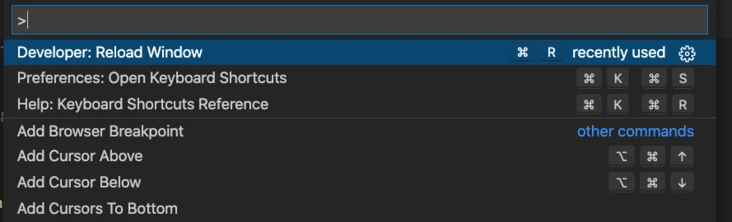


使用下面的命令是搜索文件，手动输入 `>` 也可以进入命令面板：

- Mac: `Cmd` + `P`
- Win: `Ctrl` + `P`


### 🔥 打开 setting.json 文件

如果需要改 VS Code 配置文件，可以直接通过命令面板打开。在命令面板下输入 `setting` ，然后选择 `Open Settings` ：

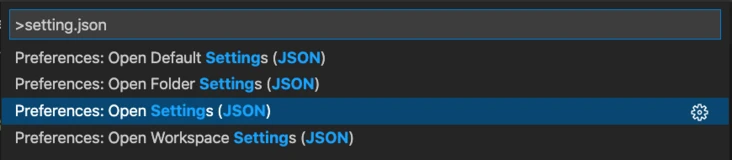

> `Default Settings` 是默认配置文件，最好不要直接改，而是通过 `setting` 去 override

打开之后内容如下：

```json
{
  "workbench.colorTheme": "Default Dark+",
  "window.zoomLevel": 1
}
```

我们可以在下面添加想要的配置。例如粘贴代码时格式化：

```json
{
  "workbench.colorTheme": "Default Dark+",
  "window.zoomLevel": 1,
  "editor.formatOnPaste": true
}
```

如果想要在代码保存时整理 import ，可以这样配置：

```json
{
  "workbench.colorTheme": "Default Dark+",
  "window.zoomLevel": 1,
  "editor.codeActionsOnSave": {
    "source.fixAll.eslint": true, // 在保存时使用 eslint 格式化
    "source.organizeImports": true // 保存时整理 import ，去掉没用的导包
  },
}
```


### 🔥 打开用户设置

- Mac: `Cmd` + `,`
- Win: `Ctrl` + `,`

相当于 `setting.json` 的图形界面，各种配置一应俱全，不用再去找文档了。


### 重启 vs code

在命令面板下中输入 `reload` ，选择 `reload window` 即可


### 设置字体大小

在命令面板中输入 `font`，可以进行字体的设置：

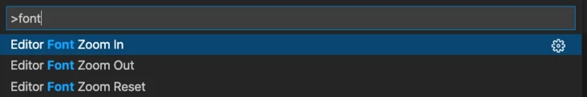


### 大小写转换

选中文本后，在命令面板中输入 `transform` ，可以修改文本的大小写：

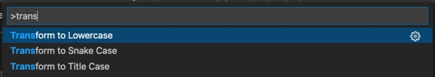


### 🔥 使用命令行启动 vs code

打开命令面板，输入 `install code command` ：

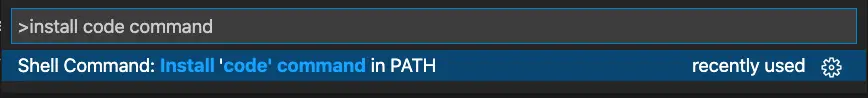

配置环境变量之后，可以在命令行中通过 `code` 启动 vs code ：

- `code .` ：使用 vs code 打开当前目录
- `code pathName/fileName` ：使用 vs code 打开指定目录/文件


## 3. 光标操作


### 🔥 在单词之间移动光标

- Mac: `Option` + 左右方向键
- Win: `Ctrl` + 左右方向键

> 如果同时按 `Shift` 还可以进行选中


### 🔥 在整行之间移动光标

- Mac: `Cmd` + 左右方向键
- Win: Fn/Win + 左右方向键 (Fn 试了无效，Win 会与 Win10 默认快捷键冲突)


### 光标定位到第一行/最后一行

定位到第一行

- Mac: `Cmd` + ↑
- Win: `Ctrl` + `Home`

定位到最后一行

- Mac: `Cmd` + ↓
- Win: `Ctrl` + `End`


### 多光标编辑

在任意位置同时出现光标：

- Mac: `Option` + 鼠标点击任意位置
- Win: `Alt` + 鼠标点击任意位置

在连续多列上同时出现光标：

- Mac: `Cmd` + `Option` + 上下键
- Win: `Ctrl` + `Alt` + 上下键


## 4. 代码相关


### 新增行

在当前行的下方新增一行（即使光标不在行尾，也能快速向下插入一行）

- Mac: `Cmd` + `Enter`
- Win: `Ctrl` + `Enter`


### 🔥 将代码向上/向下移动

单行代码移动：光标放到当前行任意位置，使用下面组合键

- Mac: `Option` + ↑ / ↓
- Win: `Alt` + ↑ / ↓

代码块移动：先选中需要移动的代码块，然后使用上面的组合键


### 🔥 将代码向上/向下复制

单行代码复制：光标放到当前行任意位置，使用下面组合键

- Mac: `Option` + `Shift` + ↑ / ↓
- Win: `Alt` + `Shift` + ↑ / ↓

代码块复制：先选中需要复制的代码块，然后使用上面的组合键

> 写重复代码的利器


### 🔥 删除整行

- Mac: `Cmd` + `Shift` + `K`
- Win: `Ctrl` + `Shift` + `K`


### 🔥 删除光标之前一个单词

- Mac: `Option` + Backspace
- Win: `Ctrl` + Backspace


### 🔥 删除光标之前的整行内容

- Mac: `Cmd` + Backspace
- Win: 没有


### 🔥 代码注释

单行注释：光标放到某一行的任意位置，使用如下快捷键

- Mac: `Cmd` + `/`
- Win: `Ctrl` + `/`

多行注释：对需要注释的代码选中，然后再使用上述快捷键即可


### 🔥 代码块移动

单行缩进：光标放到当前行最前面，使用 `TAB` 键即可

单行向前移动：光标放到当前行任意位置，使用 `Shift` + `TAB` 组合键即可

多行缩进：对需要缩进的代码选中，使用 `TAB` 即可

多行向前移动：对需要向前的代码选中，使用 `Shift` + `TAB` 组合键即可


### 🔥 代码格式化

有时候一行行调整缩进太麻烦，可以使用下面的快捷键对整个模块的代码进行格式化：

- Mac: `Option` + `Shift` + `F`
- Win: `Alt` + `Shift` + `F`


## 5. 搜索相关


### 🔥 搜索全局代码

- Mac: `Cmd` + `Shift` + `F`
- Win: `Ctrl` + `Shift` + `F`

搜索面板有个按钮可能很多同学都没注意过，点击之后就会打开搜索页面来搜索，可以预览更丰富的搜索结果：

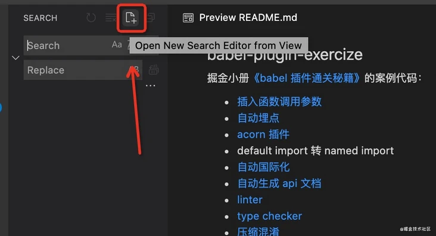

搜索 `@babel/core` 结果如下：

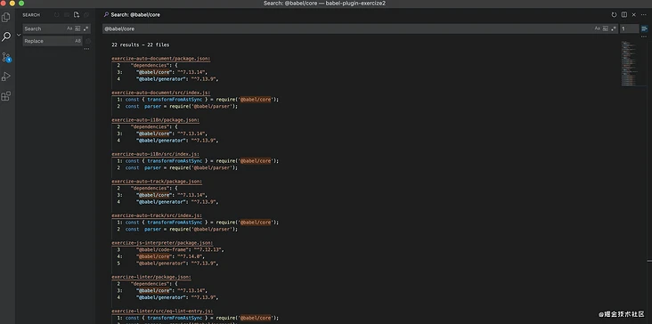


### 🔥 搜索文件名

在当前项目工程里，全局搜索文件名：

- Mac: `Cmd` + `P`
- Win: `Ctrl` + `P`

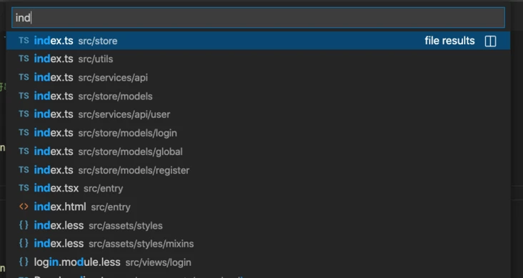


### 🔥 快速跳转到某一行

在上面的搜索框输入 `:` ，然后再输入需要跳转的行号，可以快速跳到某一行：

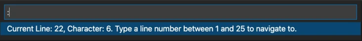

当然搜索文件的时候也可以加冒号和行号，快速跳到该文件的那一行：

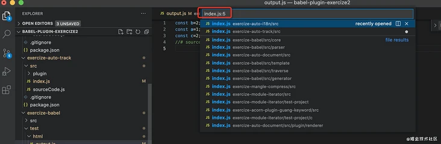


### 🔥 快速跳转到某个 Symbol

在上面的搜索框输入 `@` ，然后输入需要跳转的变量名、方法名，可以快速跳转到当前文件中的 Symbol ：

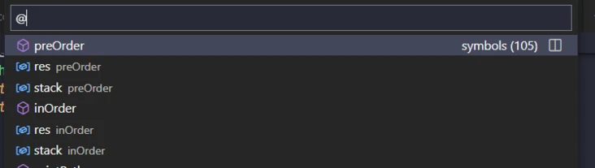


### 🔥 在当前文件中搜索代码

在当前文件中搜索代码，光标在搜索框里：

- Mac: `Cmd` + `F`
- Win: `Ctrl` + `F`


### 🔥 切换工作区

- Mac: `Cmd` + `R`
- Win: `Ctrl` + `R`

管理多个项目非常方便，随时切换。默认在当前编辑器打开，按住 `Ctrl` 可以在新窗口打开。


## 6. 文件 diff

注意：这边介绍的功能需要使用 git 才有

### 文件 diff 显示目录信息

当我们改了多个文件的时候，会列在 source control 面板的列表里，有多个同名文件的时候特别不直观。这边有一个按钮可以改为 tree view ，显示目录树：

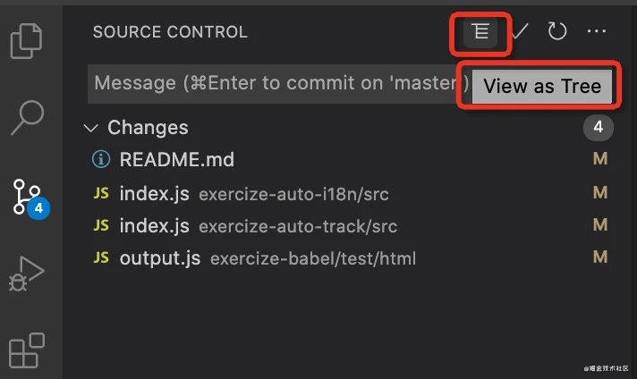

当有多个同名文件的时候，这样会清晰的多：

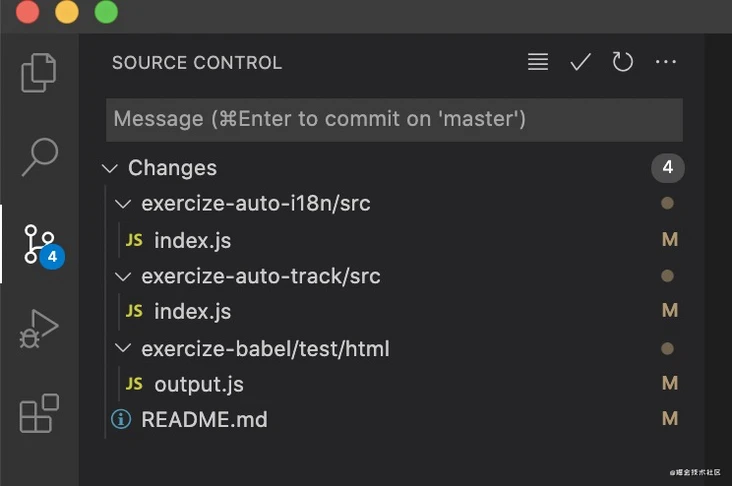


### 🔥 快速切换 diff 和文件编辑视图

当改了文件内容的时候，可以点击编辑区右上角的按钮，直接打开 diff，可能很多同学都没注意到这些按钮，但其实是很有用的。

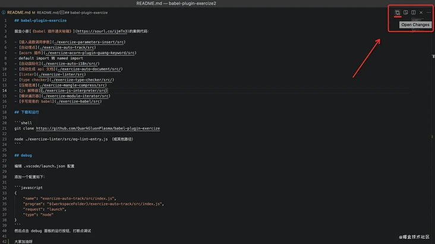

再次点击就可以回到文件编辑状态

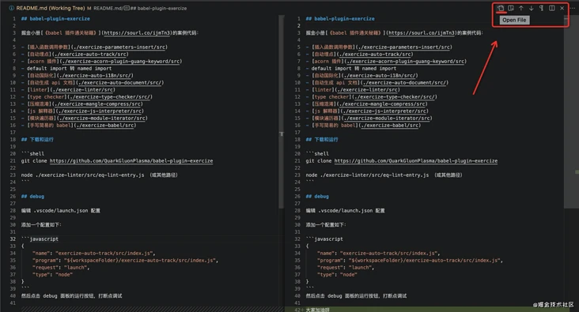


### 🔥 diff 视图快速在 diff 之间跳转

当文件内容特别多，比如好几千行的时候，要找 diff 还是比较麻烦的。其实根本不用自己去找，还容易漏，vscode 编辑器提供了上下按钮，可以直接跳到上一个 diff、下一个 diff

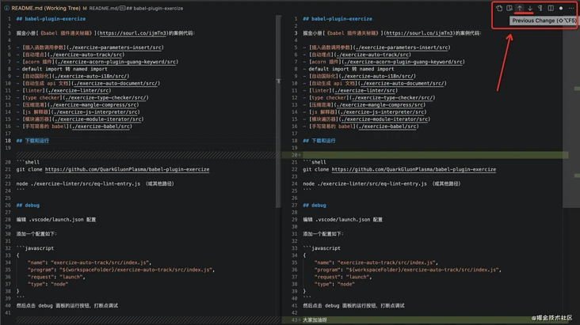


## 7. 前端相关


### 🔥 一键执行 npm scripts

vscode 会扫描所有的 npm scripts，然后列出来，直接点击 run 就会打开 terminal 来跑，而且高版本 vscode 还可以直接 debug 来跑。根本不需要自己输入 npm run xxx。

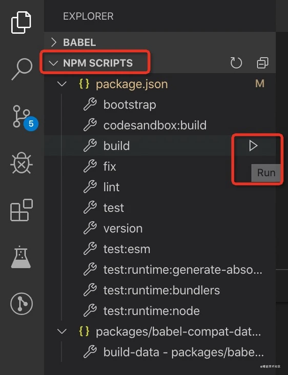


### 快速生成 HTML template

输入 `!` 然后按 `TAB` 键即可。


### 快速生成 Vue 组件模板

确保装了 Vetur 插件，输入 `<vue` 按回车即可。


### 快速输入 HTML 结构

使用 `emmet` 语法，示例如下：

```html
<!-- 输入下面内容，按回车 -->
div.user
<!-- 自动生成以下结构 -->
<div class="user"></div>

<!-- 输入下面内容，按回车 -->
div#user
<!-- 自动生成以下结构 -->
<div id="user"></div>
```

> 更多可以参考 `emmet` 用法


## 8. Cheat Sheet

快捷键太多记不住怎么办？官方有一份 Cheat Sheet ，有不清楚的随时查看一下：

> https://code.visualstudio.com/shortcuts/keyboard-shortcuts-windows.pdf


## 参考

[第一次使用VS Code时你应该知道的一切配置](https://juejin.cn/post/6844903826063884296)

[让你 vscode 写代码效率更高的技巧](https://juejin.cn/post/6986485485765918733)

