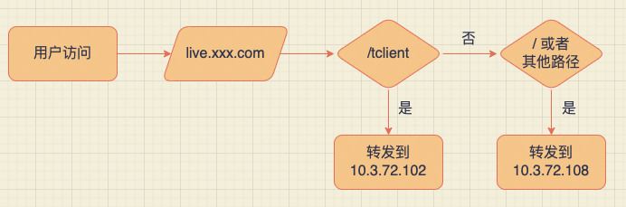
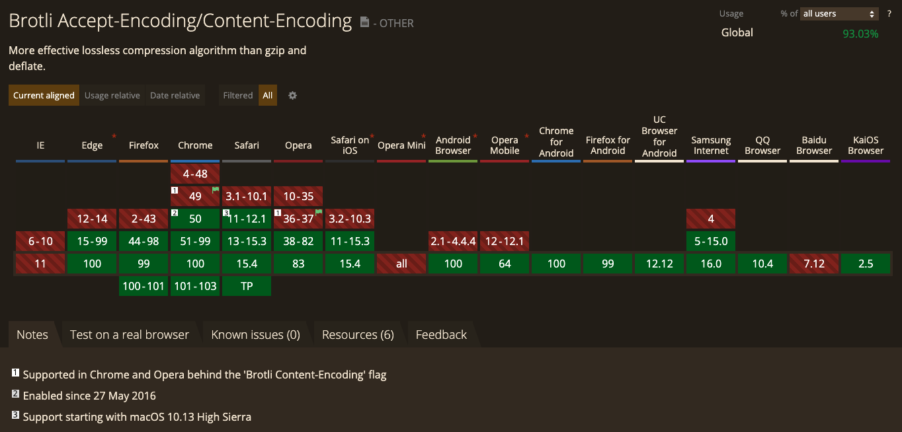
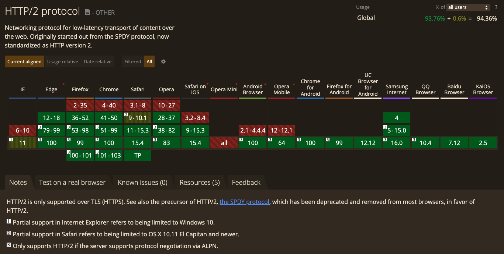

<!--truncate-->

很多同学可能都认为，配置 nginx 应该是后端做的呀。但实际上如果让后端同事配置 nginx，他可能是这样配的：

```bash
server {
    listen       80;
    server_name  localhost;

    location / {
        root   /app/build; # 打包的路径
        index  index.html index.htm;
    }

    error_page   500 502 503 504  /50x.html;
    location = /50x.html {
        root   /usr/share/nginx/html;
    }
}
```

这样的配置看似没问题，但是里面存在很多只有前端同事知道的细节问题。下面我们一起来看下。

<!-- 最近有段时间没搞项目部署了，结果在部署前端项目的时候，访问页面路由（不是根路径），nginx 响应都是 404，直接访问页面根路径，路由跳转到前端的 404 页面，排查了半天，这里再总结一下。 -->

## 1. 路由访问 404 问题

问题1：按上面的配置配好了，访问页面、路由跳转都正常，但是在非跟路径下刷新页面，nginx 直接响应 404 了。

前端单页应用路由分两种：哈希模式和历史模式。

哈希模式部署不会遇到啥问题（对 nginx 来说都是根路径访问，fragment 直接忽略掉了），但是一般只用于本地、测试环境调试，没人直接部署到生产环境。

历史模式就是正常的 URL，路由跳转通过 `pushState` 和 `replaceState` 实现，不会触发浏览器刷新页面，不会给服务器发送请求，且会触发 `popState` 事件，进而监听路由变化渲染相应页面组件，因此可以实现纯前端路由。同时路由也会被浏览器历史记录栈给记录下来，因此也能实现前进后退。

需要注意，使用历史模式的时候，还是有两种情况会导致浏览器发送请求给服务器：

- 输入地址直接访问
- 刷新页面

在这两种情况下，如果当前地址不是根路径，因为都是前端路由，服务器端根本不存在对应的文件，则会直接导致 nginx 直接响应 404。因此需要在服务器端进行配置：

```bash
server {
    listen       80;
    server_name  localhost;

    location / {
        root   /app/build; # 打包的路径
        index  index.html index.htm;

        # history 模式重点就是这里
        try_files $uri $uri/ /index.html;
    }
}
```

:::tip

`try_files` 的作用就是按顺序检查文件是否存在，返回第一个找到的文件。`$uri` 是 nginx 提供的变量，指当前请求的 URI，不包括任何参数。

当请求静态资源文件的时候，命中 `$uri` 规则；当请求页面路由的时候，命中 `/index.html` 规则。

:::

这里顺便提一下，有时候 nginx 配置是正确了，但是如果直接访问页面根路径，会跳转到前端的 404 页面，这完全是前端路由配置问题。前端路由配置的时候，没有给根路径 `/` 配置规则，而对匹配不到路由的时候，配置了 404 页面，所以访问根路径会重定向到 404 页面，这个跳转是前端操作，与 nginx 无关。正常来说，前端路由配置的时候，都会给根路径 `/` 加一个匹配规则，例如根路径重定向到 `index` 路由，可以确保用户访问根路径可以正常展示页面。

## 2. 非根路径部署访问 404 问题

问题2：在部署的时候不使用根路径，例如希望通过这样的路径去访问 `/i/top.gif`，如果直接修改 `location` 发现 nginx 还会响应 404：

```bash
location /i/ {
  root /data/w3;
  try_files $uri $uri/ /index.html;
}
```

:::tip

这是因为 `root` 是直接拼接 `root` + `location`，访问 `/i/top.gif`，实际会查找 `/data/w3/i/top.gif` 文件

:::

这种情况下推荐使用 `alias`：

```bash
location /i/ {
  alias /data/w3;
  try_files $uri $uri/ /index.html;
}
```

:::tip

`alias` 是用 `alias` 替换 `location` 中的路径，访问 `/i/top.gif`，实际会查找 `/data/w3/top.gif` 文件

:::

这里补充一下，非跟路径部署，一般后端会在网关层做反向代理，例如用户访问 `/tclient`，会直接代理到 `/` 根路径。这种情况下，这样前端静态页面的 nginx 就不需要改任何配置，直接按根路径访问去配置。只需要前端项目中，前端路由的 `basename` 和静态资源前缀改为 `/tclient` 即可。



## 3. 接口请求代理

问题3：现在页面部署成功了，但是接口请求报 404。

这是因为还没有对接口请求进行代理，下面配置一下：

```bash
location ^~ /prod-api/ {
	proxy_set_header Host $http_host;
	proxy_set_header X-Real-IP $remote_addr;
	proxy_set_header REMOTE-HOST $remote_addr;
	proxy_set_header X-Forwarded-For $proxy_add_x_forwarded_for;
	proxy_pass http://192.168.31.101:8080/;
}
```

## 4. mime type 的问题

问题4：资源都加载成功，但是页面没有样式。

看了下控制台的 network 面板，好家伙，不管 JS 还是 CSS 资源，服务器响应的 `Content-Type` 统统都是 `text/plain`。

nginx 默认的 `nginx.conf` 配置中已经有 mime type 的配置，但如果有时候把这个配置删掉了，就需要自己配置：

```bash
user  root;
worker_processes  1;

error_log  /var/log/nginx/error.log warn;
pid        /var/run/nginx.pid;


events {
    worker_connections  1024;
}


http {
    # 默认的 mime 配置
    include       /etc/nginx/mime.types;
    default_type  application/octet-stream;

    log_format  main  '$remote_addr - $remote_user [$time_local] "$request" '
                      '$status $body_bytes_sent "$http_referer" '
                      '"$http_user_agent" "$http_x_forwarded_for"';

    access_log  /var/log/nginx/access.log  main;

    sendfile        on;
    #tcp_nopush     on;

    keepalive_timeout  65;

    #gzip  on;

    # 加载 server 配置
    include /etc/nginx/conf.d/*.conf;
}
```

## 5. 开启 gzip

静态资源服务器一般都会配置报文压缩算法，用于减小网络传输的资源体积。一般常见的报文压缩算法有 `gzip`、`deflate` 等等。

如需开启 gzip，只需在 http 块中配置：

```bash
# 开启gzip
gzip on;
# 低于1kb的资源不压缩 
gzip_min_length 1k;
# 压缩文件使用缓存空间的大小，大小为 number*size
gzip_buffers 4 16k;
# gzip_http_version 1.0;
# 压缩级别 1-9，越大压缩率越高，同时消耗的 CPU 资源也越多
gzip_comp_level 4;
# 需要压缩哪些响应类型的资源，不建议压缩图片（图片压缩效果不明显，而且消耗 CPU）
gzip_types text/plain application/x-javascript text/css application/xml text/javascript application/x-httpd-php application/javascript application/json;
# 用于设置是否发送带有 Vary:accept-encoding 头部的响应头，告诉接收方是否经过了压缩
gzip_vary off;
# IE 1-6 关闭 gzip 压缩（版本太低不支持）
gzip_disable "MSIE [1-6]\.";
```

这里提一下，2015 年谷歌推出了 Brotli 压缩算法，通过变种的 LZ77 算法、Huffman 编码以及二阶文本建模等方式进行数据压缩，与其他压缩算法相比，它有着更高的压缩效率，性能也比我们目前常见的 Gzip 高 17-25%，可以帮我们更高效的压缩网页中的各类文件大小及脚本，从而提高加载速度，提升网页浏览体验。除了 IE 和 Opera Mini 之外，几乎所有的主流浏览器都已支持 Brotli 算法：



## 6. 开启 HTTP/2

环境要求
- Nginx 的版本必须在 1.9.5 以上，该版本的 Nginx 使用 http_v2_module 模块替换了 ngx_http_spdy_module；
- 开启 https 加密，目前 http2.0 只支持开启了 https 的网站；
- openssl 的版本必须在 1.0.2e 及以上；

nginx 配置：

```bash
server {
    # 开启 http2 主要就是这里
    listen  443 ssl http2;
    server_name  www.example.com;
    ssl_certificate     /opt/cert/3823818_www.example.com.pem;
    ssl_certificate_key /opt/cert/3823818_www.example.com.key;
    ssl_session_timeout 5m;
    ssl_protocols TLSv1 TLSv1.1 TLSv1.2;
    ssl_ciphers ECDHE-RSA-AES128-GCM-SHA256:HIGH:!aNULL:!MD5:!RC4:!DHE;

    location / {
        proxy_pass https://127.0.0.1:9999;
        proxy_set_header Host $host;
    }
}
```

除了 IE 和 Opera Mini 之外，几乎所有的主流浏览器都已支持 HTTP/2：



## 7. 缓存策略

除了匹配请求路径访问对应文件之外，还需要配置合理的缓存策略，提升资源二次加载性能。由于 Webpack 打包会给静态资源加上哈希值，因此可以合理配置缓存规则，提升用户体验：

- html 文件配置协商缓存（`no-cache`）
- 静态资源文件由于带有哈希，可以配置强缓存，提升资源二次加载速度（例如图片资源设置 10 天强缓存，其他资源设置 30 天强缓存）

:::tip

注意：html 文件不能配置强缓存。因为 html 文件中需要引入静态资源地址，当我们修改 JS、CSS 文件后，Webpack 会生成新的 hash，对应静态资源地址也发生变化，相当于 html 文件也发生变化。如果配置强缓存，会导致资源更新后，用户访问的仍是旧的资源；如果配置协商缓存，每次浏览器访问 html 页面都会跟服务器确认资源新鲜度，每次都加载最新的页面，从而确保加载到最新的静态资源。

:::

如何禁止客户端缓存，配置如下响应头即可关闭缓存：

```bash
Cache-Control: no-store
```

如何配置协商缓存：

```bash
Cache-Control: no-cache
# 或者
Cache-Control: max-age=0, must-revalidate
```

注意，如果服务器关闭或失去连接，下面的指令可能会造成使用缓存：

```bash
Cache-Control: max-age=0
```

## 8. location 匹配优先级

再注意下 `location` 的匹配优先级规则：

- `=` 表示精确匹配。只有请求的url路径与后面的字符串完全相等时，才会命中。
- `^~` 表示如果该符号后面的字符是最佳匹配，采用该规则，不再进行后续的查找。
- `~` 表示该规则是使用正则定义的，区分大小写。
- `~*` 表示该规则是使用正则定义的，不区分大小写。

nginx 的匹配优先顺序按照上面的顺序进行优先匹配，而且 **只要某一个匹配命中直接退出，不再进行往下的匹配**。

剩下的普通匹配会按照 **最长匹配长度优先级来匹配**，就是谁匹配的越多就用谁。

:::tip

nginx 每条规则都要以分号结尾，可以运行 `nginx -tc nginx.conf` 查看配置规则是否生效

:::

## 9. 如何配置负载均衡

通过 `proxy_pass` 与 `upstream` 即可实现最为简单的负载均衡。如下配置会对流量均匀地导向 `172.168.0.1`，`172.168.0.2` 与 `172.168.0.3` 三个服务器

```conf
http {
  upstream backend {
      server 172.168.0.1;
      server 172.168.0.2;
      server 172.168.0.3;
  }
  server {
      listen 80;
      location / {
          proxy_pass http://backend;
      }
  }
}
```

关于负载均衡的策略大致有以下四种种

1. round_robin，轮询
1. weighted_round_robin，加权轮询
1. ip_hash
1. least_conn

## Round_Robin

轮询，`nginx` 默认的负载均衡策略就是轮询，假设负载三台服务器节点为 A、B、C，则每次流量的负载结果为 ABCABC

## Weighted_Round_Robin

加权轮询，根据关键字 weight 配置权重，如下则平均没来四次请求，会有八次打在 A，会有一次打在 B，一次打在 C

```conf
upstream backend {
  server 172.168.0.1 weight=8;
  server 172.168.0.2 weight=1;
  server 172.168.0.3 weight=1;
}
```

## IP_hash

对每次的 IP 地址进行 Hash，进而选择合适的节点，如此，每次用户的流量请求将会打在固定的服务器上，利于缓存，也更利于 AB 测试等。

```conf
upstream backend {
  server 172.168.0.1;
  server 172.168.0.2;
  server 172.168.0.3;
  ip_hash;
}
```

## Least Connection

选择连接数最少的服务器节点优先负载

```conf
upstream backend {
  server 172.168.0.1;
  server 172.168.0.2;
  server 172.168.0.3;
  least_conn;
}
```

## 10. 完整的 nginx 配置

```bash
server {
  listen 80;
  server_name www.example.com;

  # html 页面访问
  location /ruoyi/ {
    # 支持 /ruoyi 子路径访问
    alias /root/workspace/ruoyi-ui/dist;

    # history 模式重点就是这里
    try_files $uri $uri/ /index.html;

    # html 文件不可设置强缓存，设置协商缓存即可
    add_header Cache-Control 'no-cache, must-revalidate, proxy-revalidate, max-age=0';
  }

  # 接口请求代理
  location ^~ /prod-api/ {
    proxy_set_header Host $http_host;
    proxy_set_header X-Real-IP $remote_addr;
    proxy_set_header REMOTE-HOST $remote_addr;
    proxy_set_header X-Forwarded-For $proxy_add_x_forwarded_for;
    proxy_pass http://192.168.31.101:8080/;
  }

  # 静态资源访问
  location ~* \.(?:png|jpg|jpeg|webp|gif|bmp|tiff|ico|svg)$ {
    # 图片资源设置 10 天强缓存
    add_header Cache-Control 'public, max-age=864000';
  }

  location ~* \.(?:css(\.map)?|js(\.map)?)$ {
    # 其他资源设置 30 天强缓存
    add_header Cache-Control 'public, max-age=2592000';
  }
}
```

## 11. 总结

单页应用历史模式路由，如果不是根路径，请求服务器都会响应 404，需要在服务器端配置 `try_files` 按顺序进行匹配，其中请求页面路由命中 `/index.html` 规则，请求静态资源命中 `$uri` 规则。

当页面部署在子路径下的时候，使用 `root` 会拼接 `root` + `location`，使用 `alias` 则是用 `alias` 替换 `location` 中的路径。

前端项目部署的时候，还需要配置接口请求代理。

给 html 文件配置协商缓存，由于静态资源文件会带哈希，因此可以给静态资源文件配置强缓存。

`location` 匹配的优先级规则注意下。

## 参考

[前端到底用nginx来做啥](https://juejin.cn/post/7064378702779891749)

[一份简单够用的 Nginx Location 配置讲解](https://juejin.cn/post/7048952689601806366)
