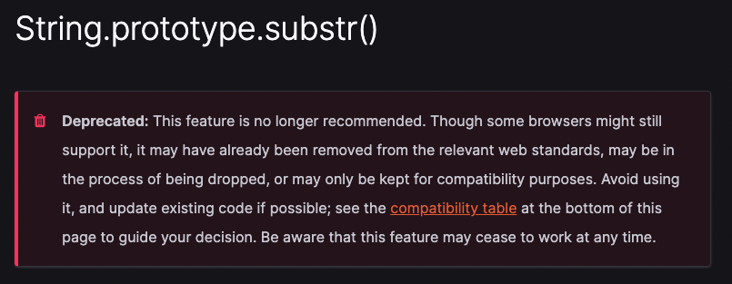

<!--truncate-->

本来不想说这个事情，但是还是看到同事在代码中使用了 `substr` 这个 API，如果你查过 MDN 文档就会知道，这个 API 现在已经废弃了：

那么截取字符串应该用什么 API 呢，可以使用下面两种：

- `String.prototype.slice`
- `String.prototype.substring`

有些同学可能会说，数组也有 `slice` 方法呀。没错，字符串和数组有一些同名的方法，例如 `slice`、`concat` 等等，这是因为字符串实际上就是 `char` 类型数组，并且字符串跟数组一样都实现了 `Symbol.iterator` 接口。

那么 `slice` 和 `substring` 有哪些区别呢，主要是对负索引的处理不同：

- `substring()` 会将负索引当做 `0` 处理，而 `slice()` 会从右往左进行定位；
- 如果 `indexStart > indexEnd`，`substring()` 会对两个参数进行交换；

:::tip

详细用法可以参考 MDN 文档：

https://developer.mozilla.org/en-US/docs/Web/JavaScript/Reference/Global_Objects/String/substring#differences_between_substring_and_slice

:::

一般来说，如果不涉及负索引，更推荐使用 `substring()`。为啥呢，我们知道 JS 实际上是弱类型语言，你用 `slice()` 别人可能认为这是一个数组，而如果用 `substring()` 等于显示声明了这是一个字符串。
