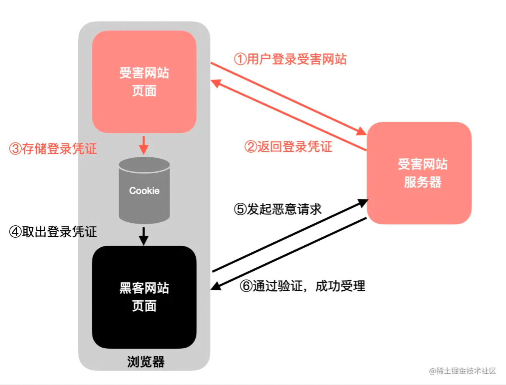

<!--truncate-->

## 1. 同源策略

首先为什么要有同源策略？浏览器需要记住用户的登录状态（即登录凭证），这样用户下次访问页面就无需重复登录。这样的话，就需要有一些安全策略，否则很容易出现 CSRF 攻击等问题。如果是其他的 http client 则没有同源策略。

> 如果严格按照同源政策，第2步的跨域请求不能进行的，也就不会造成危害。所以CORS策略的心智模型是：所有跨域请求都是不安全的，浏览器要带上来源给服务器检验

同源策略会限制哪些行为：

- 跨域情况下获取 DOM 元素（例如跨域的 `iframe`）、localStorage、Cookie 等
- 跨域情况下发送 ajax 请求，浏览器会拒绝解析响应报文

> 注意，浏览器默认的表单提交不受同源策略限制

## 2. CORS

CORS 即跨域资源共享，这里注意 CORS 的目的不是拦截请求，反倒是为了让其能正常请求。CORS 的诞生背景就是同源策略，这是一个相当严苛的规定，它禁止了跨域的AJAX请求。但实际的开发中又有这样的需求，于是开一个口子——只要配置了CORS的对应规则，跨域请求就能正常进行。

如何配置 CORS？前端在发送请求的时候，浏览器会在请求头添加 `Origin` 字段，这样后端就能知道请求的来源，然后后端在响应头添加 `Access-Control-Allow-Origin`，这个值就是前端发送的来源地址（或者直接加 `*` 表示允许所有地址）。

## 3. 跨域请求的流程

CORS把请求分成简单请求和复杂请求，划分的依据是“是否会产生副作用”。同时满足下面这两个条件的是 **简单请求**，否则就是 **非简单请求**：

- 请求方法是 HEAD/GET/POST
- 请求体的 Conent-Type 只能是 `form-urlencoded`、`form-data`、`text/plain`

对于简单请求，流程如下：

1. 浏览器发起请求，并且自动加上请求的来源 `origin` 给服务器检查；
2. 服务器返回数据，并返回检查结果，配置CORS响应头；
3. 浏览器检查CORS响应头，如果包含了当前的源则放行，反之拦截；

> 这里需要注意，浏览器是拦截响应，而不是拦截请求，跨域请求是发出去的，并且服务端做了响应，只是浏览器拦截了下来

对于复杂请求，流程如下：

1. 浏览器发起预检请求，带上请求的来源 `origin`，不包含请求体；
2. 服务器返回检查结果，配置CORS头；
3. 浏览器发起真正请求；
4. 浏览器返回数据；

> 浏览器会检查第2步中拿到的CORS头，如果没有包含当前的源，后续的第3、4步都不会进行，也就是不会发起真正请求

## 4. 为什么只对复杂请求做预检

为什么只对复杂请求做预检？上文提到，划分简单请求和复杂请求的依据是“是否产生副作用”。这里的副作用指对 **数据库做出修改**：使用GET请求获取新闻列表，数据库中的记录不会做出改变，而使用PUT请求去修改一条记录，数据库中的记录就发生了改变。

假设网站被CSRF攻击了——黑客网站向银行的服务器发起跨域请求，并且这个银行的安全意识很弱，只要有登录凭证cookie就可以成功响应，考虑下面两种情况：

- 黑客网站发起一个GET请求，目的是查看受害用户本月的账单。银行的服务器会返回正确的数据，不过影响并不大，而且由于浏览器的拦截，最后黑客也没有拿到这份数据；
- 黑客网站发起一个PUT请求，目的是把受害用户的账户余额清零。浏览器会首先做一次预检，发现收到的响应并没有带上CORS响应头，于是真正的PUT请求不会发出；

幸好有预检机制，否则PUT请求一旦发出，黑客的攻击就成功了。

> 这种情况下，后端也需要遵循 RESTful 规范，否则要么面临攻击风险，要么会多发一次预检请求

[腾讯一面：CORS为什么能保障安全？为什么只对复杂请求做预检](https://juejin.cn/post/7081539471585312805)

[腾讯三面：Cookie的SameSite了解吧，那SameParty呢](https://juejin.cn/post/7087206796351242248)
