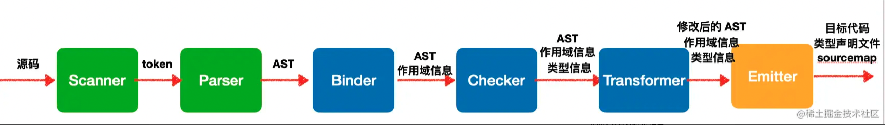
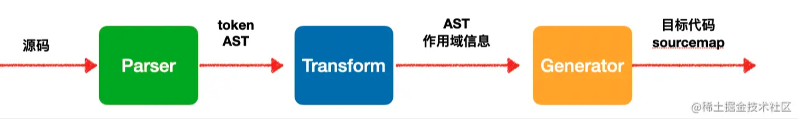

<!--truncate-->

## 编译流程区别

### 1) tsc 的编译流程

TypeScript Compiler 的编译流程如下：

- 源码首先用 Scanner 进行词法分析，拆分成一个个不能细分的单词，叫做 token
- 然后用 Parser 进行语法分析，组装成抽象语法树 AST
- 之后做语义分析，包括用 Binder 进行作用域分析，和有 Checker 做类型检查。如果有类型的错误，就是在 Checker 这个阶段报的
- 如果有 Transformer 插件（tsc 支持 custom transform），会在 Checker 之后调用，可以对 AST 做各种增删改
- 类型检查通过后就会用 Emmiter 把 AST 打印成目标代码，生成类型声明文件 d.ts，还有 sourcemap

### 2) Babel 的编译流程

- 源码经过 `@babel/parser` 做词法分析和语法分析，生成 token 和 AST
- AST 会做语义分析生成作用域信息，然后会调用 `@babel/traverse` 进行 AST 的转换
- 最后会用 `@babel/generator` 把 AST 打印成目标代码并生成 sourcemap

其实对比下 Babel 和 tsc 的编译流程，区别并不大：

- `@babel/parser` 对应 tsc 的 Scanner 和 Parser，都是做词法分析和语法分析，只不过 babel 没有细分
- `@babel/traverse` 阶段做语义分析和代码转换，对应 tsc 的 Binder 和 Transformer。**只不过 babel 不会做类型检查，没有 Checker**。
- `@babel/generator` 做目标代码和 sourcemap 的生成，对应 tsc 的 Emitter。**只不过因为没有类型信息，不会生成 d.ts**。

对比两者的编译流程，会发现 Babel 除了不会做类型检查和生成类型声明文件外，tsc 能做的事情，babel 都能做。但实际上，Babel 和 tsc 实现这些功能是有区别的。

## Babel 和 tsc 的区别

抛开类型检查和生成 d.ts 这俩 babel 不支持的功能，看下其他功能的对比。

### 1) ES next 语法转换

tsc 默认支持最新的 ES 规范的语法和部分还在提案阶段的语法（比如 decorators），想支持新语法必须升级 tsc 的版本。

Babel 是通过 `@babel/preset-env` 按照目标环境 targets 的配置自动引入需要用到的插件来支持标准语法，对于还在提案阶段的语法需要单独引入 `@babel/proposal-xx` 的插件来支持。

所以如果你只用标准语法，那用 tsc 或者 Babel 都行，但是如果你想用一些提案阶段的语法，tsc 可能很多都不支持，而 Babel 却可以引入 `@babel/poposal-xx` 的插件来支持。

从支持的语法特性上来说，Babel 更多一些。

### 2) API 兼容

tsc 生成的代码没有做 polyfill 的处理，想做兼容处理就需要手动在入口文件全量引入 core-js。

Babel 的 `@babel/preset-env` 可以根据 targets 的配置来自动引入需要的语法插件，和引入需要用到的 core-js 模块，引入方式可以通过 `useBuiltIns` 来配置：

- `entry` 是在入口引入根据 targets 过滤出的所有需要用的 core-js
- `usage` 则是每个模块按照使用到了哪些来按需引入

此外，Babel 会注入一些 helper 函数，可以通过 `@babel/plugin-transform-runtime` 插件抽离出来，从 `@babel/runtime` 包引入。

综上，tsc 不支持 polyfill，想做兼容处理只能手动在入口文件全量引入 polyfill。而 Babel 则可以用 `@babel/preset-env` 根据 targets 的配置按需引入 polyfill，所以生成的代码体积更小。因此，如果使用 Babel 编译 TS，可以复用 Babel 的 AST，同时语法转换、polyfill 等功能也能一并享受。

### 3) TS 语法支持

虽说 Babel 在处理 ES2015+ 语法、API 兼容性这块比较灵活，但是 Babel 对某些 TS 语法支持不太好。

Babel 是单文件编译器，编译 TS 其实就是直接删除类型注解。实际上 Babel 想类型检查也做不到，进行类型验证之前，需要解析项目中所有的文件，收集类型信息。由于 Babel 的单文件特性，`@babel/preset-typescript` 对于需要收集完整类型系统信息才能正确运行的 TypeScript 语言特性，支持不是很好。

#### const enum 不支持

`const enum` 是在编译期间把 `enum` 的引用替换成具体的值，需要解析类型信息，而 Babel 并不会解析，所以它会把 `const enum` 转成 `enum` 来处理。

#### namespace 部分支持：不支持 namespace 的合并，不支持导出非 const 的值

这些其实影响并不大，只要代码里没用到这些语法，完全可以用 Babel 来编译 ts。

## 编译 TS 用 Babel 还是 tsc

Babel 和 tsc 的编译流程大同小异，都有把源码转换成 AST 的 Parser，都会做语义分析（作用域分析）和 AST 的 transform，最后都会用 Generator（或者 Emitter）把 AST 打印成目标代码。

在 ES 语法特性支持上，Babel 更强一些。Babel 通过 `@babel/preset-env` 支持所有标准特性，也可以通过 `@babel/proposal-xx` 来支持各种非标准特性。

在 API 兼容性方面，Babel 可以使用 `@babel/preset-env` 会根据 targets 的配置按需引入 polyfill。

但由于 Babel 是单文件编译，不能进行类型检查，对某些 TS 语法支持不是很好。但是这些影响不大，如果想做类型检查，可以单独起一个进程执行 `tsc --noEmit`。

## 参考

[编译 ts 代码用 tsc 还是 babel](https://juejin.cn/post/7084882650233569317)
