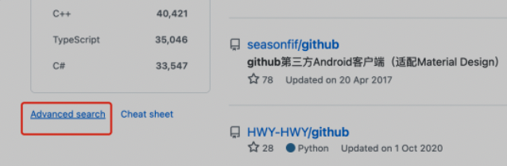

<!--truncate-->

## 1. 搜索技巧

按快捷键 `s` 直接聚焦到搜索框，然后输入一串神秘代码：`springboot vue stars:>1000 pushed:>2022-05-02 language:Java` ，再按回车搜索，就能轻松快速地得到精确的、最新的结果。

这一串神秘代码呢，其实是利用了 GitHub 高级搜索功能提供的 `搜索限定符` 。

当然，完全不用记这些，进入 advance search 界面（搜索结果页左下角），利用可视化表单也能实现高级搜索：

但这个界面展示的搜索条件有限，其实还有更多的搜索限定语法，比如按代码库名称、描述搜索，对仓库中的内容进行搜索等，这些都可以在 GitHub 官方文档查阅，不用去背！

> 官方文档：https://docs.github.com/cn/search-github/getting-started-with-searching-on-github/about-searching-on-github

## 2. 阅读源码技巧

直接在仓库详情页按下 `.` 键，可以直接打开网页版 VS Code 编辑器。
