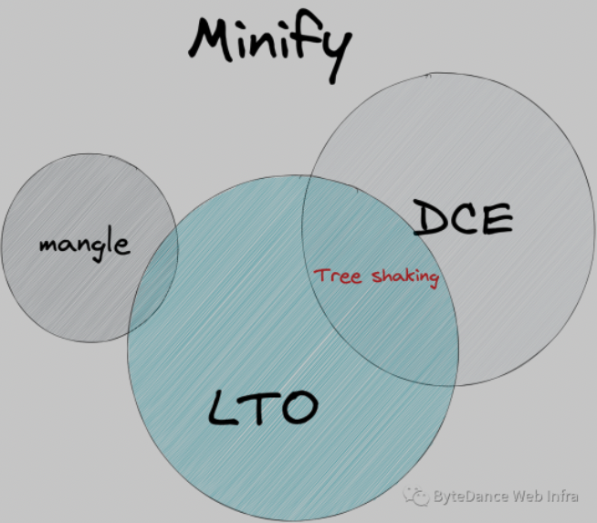

<!--truncate-->

Tree shaking在不同工具里的意义不太统一，为了统一后续讨论，我们规范各个术语：

- minify：编译优化手段，指在不影响代码语义的情况下，尽可能的减小程序的体积，常见的 minify 工具如 terser、uglify，swc 和 esbuid 也自带 minify 功能
- Dead code elimination(DCE)：即死代码优化，一种编译器优化手段，用于移除不影响程序结果的代码，实现DCE的手段有很多种，如 const folding (常量折叠)、Control flow analysis、也包括下面的 LTO
- Link Time Optimization：指 link 期优化的手段，可以进行跨模块的分析优化，如可以分析模块之间的引用关系，删掉其他模块未使用的导出变量，也可以进行跨模块对符号进行 mangle http://johanengelen.github.io/ldc/2016/11/10/Link-Time-Optimization-LDC.html
- Tree shaking：一种在 Javascript 社区流行的一个术语，是一种死代码优化手段，其依赖于 ES2015 的模块语法，由 rollup 引入。这里的 tree shaking 通常指的是基于 module 的跨模块死代码删除技术，即基于 LTO 的 DCE，其区别于一般的 DCE 在于，其只进行 top-level 和跨模块引用分析，并不会去尝试优化如函数里的实现的 DCE

> Tree shaking is a term commonly used in the JavaScript context for dead-code elimination. It relies on the static structure of ES2015 module syntax, i.e. import and export. The name and concept have been popularized by the ES2015 module bundler rollup.   
> 
> https://webpack.js.org/guides/tree-shaking/

- mangle：即符号压缩，将变量名以更短的变量名进行替换
- 副作用：对程序状态造成影响，死代码优化一般不能删除副作用代码，即使副作用代码的结果在其他地方没用到
- 模块内部副作用：副作用影响范围仅限于当前模块，如果外部模块不依赖当前模块，那么该副作用代码可以跟随当前模块一起被删除，如果外部模块依赖了当前模块，则该副作用代码不能被删除

因此我们的后续讨论，所说的 tree shaking 均是指基于 LTO 的 DCE，而 DCE 指的是不包含 tree shaking 的其他 DCE 部分。

> 简单来说即是，tree shaking 负责移除未引用的 top-level 语句，而 DCE 删除无用的语句

[Tree shaking问题排查指南来啦](https://mp.weixin.qq.com/s/P3mzw_vmOR6K_Mj-963o3g)
