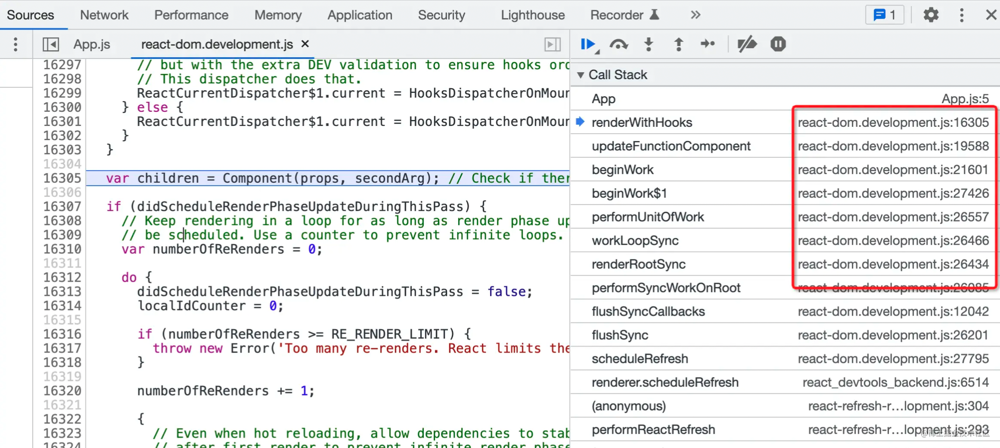

<!--truncate-->

## 1. 如何在 VS Code 中调试 React 源码

由于 React 是在浏览器环境下运行的，因此调试 React 源码最直接的方式是在 Chrome Devtools 里面。



但实际上，只要调试客户端支持 Chrome Debug Protocol，就可以用来调试浏览器端的代码，因此调试客户端可以是 Chrome Devtools 也可以是 VSCode（反过来 Chrome Devtools 还可以调试 Node 代码）。

但是在 VS Code 中调试，需要让 VS Code 连接调试服务，这就需要做一些配置：

```json title=".vscode/launch.json"
{
  "configurations": [
    {
      "name": "Launch Chrome",
      "request": "launch",
      "type": "chrome",
      "url": "http://localhost:8080",
      "webRoot": "${workspaceFolder}"
    }
  ]
}
```

> 其中 `url` 就是前端页面的地址

然后点击 debug 启动，这时候就可以在 VS Code 里直接打断点调试了。

## 2. 如何映射源码

现在只能在 `react-dom.development.js` 里调试，如果需要映射到源码，就需要 sourcemap，但是 React 的 NPM 包并没有提供 sourcemap，需要我们自己 build 源码生成 sourcemap。

我们需要改造 build 流程，开启 sourcemap，对 react 源码进行了 build，产生了带有 sourcemap 的 react、react-dom 包，这些包最终导出的是 react-xx.development.js。

但是这边有个问题，如果直接在项目中引入这些包，经过 webpack 打包，产生了 bundle.js 和 sourcemap。之后调试工具运行代码的时候，会解析 sourcemap，完成从 bundle.js 到 react-xxx.development.js 的映射，但是并不会再次做 react-xx.development.js 到 react 最初源码的映射。也就是调试工具只会解析一次 sourcemap。

这种情况下，我们不打包 react 和 react-dom 这俩包不就行了，不经过 webpack 打包，那就没有 webpack 产生的 sourcemap，不就一次就映射到 React 最初的源码了么。

我们需要使用 UMD 格式的包，直接通过 `<script>` 标签引入，挂载到全局变量上。同时 webpack 支持 externals 来配置一些模块使用全局变量而不进行打包。修改 webpack 配置，在 externals 下添加 react 和 react-dom 包对应的全局变量。

然后把 react.development.js 和 react-dom.development.js 放到 public 下，并在 index.html 里面直接通过 `<script>` 标签加载这俩文件。

这样再重新 debug，你就会发现 sourcemap 映射到 React 最初的源码了。

## 参考

[全网最优雅的 React 源码调试方式](https://juejin.cn/post/7126501202866470949)
